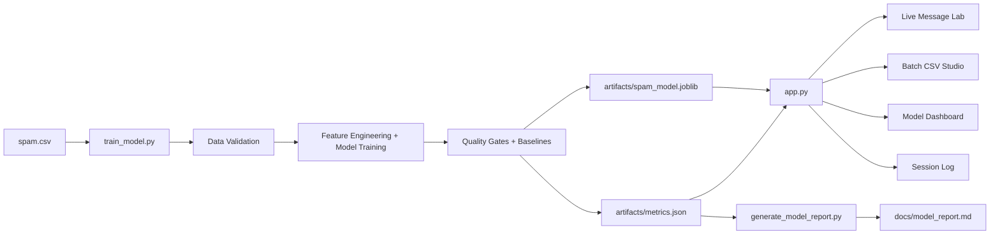

# Architecture Diagram

## Notes
- Training and inference share preprocessing from `text_preprocessing.py`.
- The app consumes both model artifact and metrics payload.
- Threshold sweep + keyword signals are surfaced in the dashboard for explainability.
