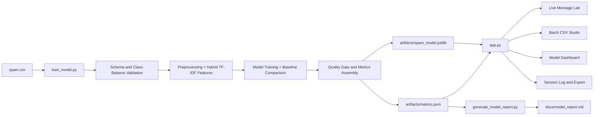

# Comprehensive Technical Report - SMS Spam Shield

Generated on: 2026-04-23T11:35:20
Loaded metrics source: `artifacts/metrics.json`
Model version: `spam_shield_20260423_113509`

## 1) Abstract
SMS Spam Shield is an end-to-end text-classification system that operationalizes SMS spam detection from data ingestion through deployable inference UI.
The system combines machine-learning rigor, reproducibility controls, model risk analysis, and product-grade interaction modes (live scoring + batch processing).
This document is intentionally research-heavy and engineering-deep, covering architecture, algorithms, full repository structure, function-level index, testing strategy, and collaborative team ownership.

## 2) Problem Definition and Research Context
Task type: binary supervised text classification.
Given message text `x`, estimate `P(y=spam|x)`.
Decision rule in production:
`y_hat = 1 if P(y=spam|x) >= tau else 0`,
where `tau` is configurable threshold.

Project success criteria:
1. F1 target: `> 0.95`
2. ROC AUC target: `> 0.98`

Latest achieved:
1. F1: `0.9533`
2. ROC AUC: `0.9945`
3. Threshold criteria met: `True`
4. Quality gate pass: `True`

## 3) Data Foundation and Contract
Dataset source file: `spam.csv`
Accepted input schema:
1. (`v1`, `v2`) or
2. (`label`, `message`)

Label contract:
1. `ham` -> 0
2. `spam` -> 1
3. non-contract labels rejected

Latest dataset profile:
1. total rows: `5572`
2. train rows: `4457`
3. test rows: `1115`
4. validation summary: `{'ham_count': 4825, 'spam_count': 747, 'minority_ratio': 0.1341, 'total_rows': 5572}`

## 4) Text Preprocessing and Feature Representation
Normalization objective:
preserve spam-discriminative cues while reducing lexical noise.

Key transformations:
1. URL normalization to token placeholder.
2. numeric normalization (`longnumber`, `number`).
3. character filtering with currency preservation.
4. whitespace canonicalization.

Feature stack:
1. Word TF-IDF (1-2 grams).
2. Character TF-IDF (`char_wb`, 3-5 grams).
3. FeatureUnion to merge lexical and subword signals.

Theoretical motivation:
1. word n-grams capture semantic spam keywords.
2. char n-grams capture obfuscation and stylistic spam patterns.
3. hybridization improves robustness under noisy SMS syntax.

## 5) Modeling Strategy and Algorithm Selection
Primary production classifier:
1. Logistic Regression (balanced class weighting, deterministic random state).
2. Hyperparameter tuning over regularization strength `C`.

Baseline suite (formalized from notebook experimentation):
1. Naive Bayes baseline.
2. Linear SVM baseline.
3. Logistic (current production).

Best baseline F1 observed: `Linear SVM baseline` with `0.9589`.
Production still uses Logistic because:
1. calibrated probability output supports threshold control in UI workflows.
2. coefficient-level interpretability enables transparent keyword signal explanation.
3. strong ROC-AUC and stable operational behavior across report runs.

| Model | Accuracy | Precision | Recall | F1 | ROC AUC |
| --- | --- | --- | --- | --- | --- |
| Logistic (current) | 0.9874 | 0.9470 | 0.9597 | 0.9533 | 0.9945 |
| Naive Bayes baseline | 0.9830 | 0.9924 | 0.8792 | 0.9324 | 0.9881 |
| Linear SVM baseline | 0.9892 | 0.9790 | 0.9396 | 0.9589 | 0.9922 |

## 6) Evaluation Analytics
Confusion matrix (latest holdout):
1. TN: `958`
2. FP: `8`
3. FN: `6`
4. TP: `143`

Operational interpretation:
1. FP contributes to false alarms and user-friction costs.
2. FN contributes to spam leakage and risk exposure.
3. Threshold governance is therefore a policy decision, not only a model score decision.

### Threshold Sweep
| Threshold | Precision | Recall | F1 | Spam Alert Rate |
| --- | --- | --- | --- | --- |
| 0.20 | 0.8727 | 0.9664 | 0.9172 | 0.1480 |
| 0.30 | 0.9167 | 0.9597 | 0.9377 | 0.1399 |
| 0.40 | 0.9470 | 0.9597 | 0.9533 | 0.1354 |
| 0.50 | 0.9470 | 0.9597 | 0.9533 | 0.1354 |
| 0.60 | 0.9660 | 0.9530 | 0.9595 | 0.1318 |
| 0.70 | 0.9653 | 0.9329 | 0.9488 | 0.1291 |
| 0.80 | 0.9718 | 0.9262 | 0.9485 | 0.1274 |

### Top Learned Signals - Spam Class
| Token | Weight |
| --- | --- |
| longnumber | 5.6730 |
| urltoken | 2.8343 |
| number number | 2.6365 |
| number | 2.5447 |
| txt | 2.4039 |
| uk | 2.2271 |
| sms | 2.2034 |
| to longnumber | 2.1836 |
| your | 2.1437 |
| reply | 2.1236 |
| free | 2.0877 |
| text | 2.0417 |

### Top Learned Signals - Ham Class
| Token | Weight |
| --- | --- |
| me | -1.7053 |
| my | -1.6520 |
| lt | -1.3531 |
| gt | -1.3321 |
| lt gt | -1.2147 |
| at | -1.1751 |
| at number | -1.1150 |
| ok | -1.0582 |
| got | -0.9622 |
| but | -0.9199 |
| that | -0.9085 |
| ll | -0.8935 |

### Error Analysis - False Positives
### False Positives (10 examples)
1. `645`
   - spam_probability: `0.9928`
   - diagnostic_reason: Ham message contains strong spam-like terms: number.
2. `U 2.`
   - spam_probability: `0.9888`
   - diagnostic_reason: Ham message contains strong spam-like terms: number.
3. `Yun ah.the ubi one say if Ì_ wan call by tomorrow.call 67441233 look for irene.ere only got bus8,22,65,61,66,382. Ubi cres,ubi tech park.6ph for 1st 5wkg days.̬n`
   - spam_probability: `0.9452`
   - diagnostic_reason: Ham message contains strong spam-like terms: longnumber, number number, number.
4. `Yep then is fine 7.30 or 8.30 for ice age.`
   - spam_probability: `0.9032`
   - diagnostic_reason: Ham message contains strong spam-like terms: number number, number, for.
5. `MY NO. IN LUTON 0125698789 RING ME IF UR AROUND! H*`
   - spam_probability: `0.8706`
   - diagnostic_reason: Ham message contains strong spam-like terms: longnumber, number, to.
6. `Waiting for your call.`
   - spam_probability: `0.6713`
   - diagnostic_reason: Ham message contains strong spam-like terms: your, for.
7. `I'm vivek:)i got call from your number.`
   - spam_probability: `0.6597`
   - diagnostic_reason: Ham message contains strong spam-like terms: number, your.
8. `I liked the new mobile`
   - spam_probability: `0.6512`
   - diagnostic_reason: Message style looked promotional or numeric despite being legitimate.
9. `Wewa is 130. Iriver 255. All 128 mb.`
   - spam_probability: `0.6511`
   - diagnostic_reason: Ham message contains strong spam-like terms: number.
10. `This is ur face test ( 1 2 3 4 5 6 7 8 9  &lt;#&gt;  ) select any number i will tell ur face astrology.... am waiting. quick reply...`
   - spam_probability: `0.6504`
   - diagnostic_reason: Ham message contains strong spam-like terms: number number, number, reply.

### Error Analysis - False Negatives
### False Negatives (10 examples)
1. `Do you ever notice that when you're driving, anyone going slower than you is an idiot and everyone driving faster than you is a maniac?`
   - spam_probability: `0.0069`
   - diagnostic_reason: Spam message looks conversational with ham-like terms: at, that.
2. `Hello darling how are you today? I would love to have a chat, why dont you tell me what you look like and what you are in to sexy?`
   - spam_probability: `0.0150`
   - diagnostic_reason: Spam message looks conversational with ham-like terms: me, at, ok.
3. `How come it takes so little time for a child who is afraid of the dark to become a teenager who wants to stay out all night?`
   - spam_probability: `0.0184`
   - diagnostic_reason: Spam message looks conversational with ham-like terms: me, ll, da.
4. `Did you hear about the new \Divorce Barbie\"? It comes with all of Ken's stuff!"`
   - spam_probability: `0.0184`
   - diagnostic_reason: Spam message looks conversational with ham-like terms: me, ll.
5. `Hello. We need some posh birds and chaps to user trial prods for champneys. Can i put you down? I need your address and dob asap. Ta r`
   - spam_probability: `0.0310`
   - diagnostic_reason: Spam message looks conversational with ham-like terms: me, ll.
6. `Do you realize that in about 40 years, we'll have thousands of old ladies running around with tattoos?`
   - spam_probability: `0.0381`
   - diagnostic_reason: Spam message looks conversational with ham-like terms: at, that, ll.
7. `Would you like to see my XXX pics they are so hot they were nearly banned in the uk!`
   - spam_probability: `0.0408`
   - diagnostic_reason: Spam message looks conversational with ham-like terms: my.
8. `Hi ya babe x u 4goten bout me?' scammers getting smart..Though this is a regular vodafone no, if you respond you get further prem rate msg/subscription. Other nos used also. Beware!`
   - spam_probability: `0.0482`
   - diagnostic_reason: Spam message looks conversational with ham-like terms: me, at, got.
9. `For sale - arsenal dartboard. Good condition but no doubles or trebles!`
   - spam_probability: `0.0505`
   - diagnostic_reason: Spam message looks conversational with ham-like terms: but, da.
10. `Latest News! Police station toilet stolen, cops have nothing to go on!`
   - spam_probability: `0.0577`
   - diagnostic_reason: Spam message looks conversational with ham-like terms: at.

## 7) Architecture and Runtime Dataflow


Design highlights:
1. shared preprocessing module avoids train-serving skew.
2. report generation is data-driven from artifacts payload.
3. product dashboard binds directly to persisted metrics for traceable analytics.

## 8) Function-Level Technical Index
### train_model.py
| train_model.py function | Line |
| --- | --- |
| set_reproducible_seeds | 54 |
| get_package_versions | 59 |
| load_dataset | 69 |
| validate_training_data | 101 |
| build_feature_union | 126 |
| build_logistic_pipeline | 147 |
| build_notebook_baseline_models | 165 |
| make_word_vectorizer | 168 |
| score_model_predictions | 192 |
| evaluate_model | 202 |
| extract_top_keywords | 227 |
| compute_threshold_sweep | 248 |
| infer_error_reason | 268 |
| collect_error_examples | 296 |
| load_previous_metrics | 346 |
| enforce_f1_quality_gate | 355 |
| evaluate_success_criteria | 377 |
| train | 392 |

### app.py
| app.py function | Line |
| --- | --- |
| normalize_text | 29 |
| inject_styles | 33 |
| inject_background_orbs | 564 |
| load_model_payload | 578 |
| predict_text | 588 |
| render_probability_meter | 595 |
| get_signal_matches | 607 |
| add_to_history | 628 |
| render_sidebar | 646 |
| read_uploaded_csv | 669 |
| load_metrics_fallback | 704 |
| validate_prediction_schema | 718 |
| show_roc | 737 |
| show_confusion_matrix | 776 |
| show_top_keywords | 806 |
| show_threshold_sweep | 839 |
| render_live_tab | 877 |
| render_batch_tab | 955 |
| render_dashboard_tab | 1072 |
| render_session_log_tab | 1088 |
| render_user_guide_tab | 1113 |
| render_quick_stats_strip | 1127 |
| main | 1144 |

### generate_model_report.py
| generate_model_report.py function | Line |
| --- | --- |
| md_table | 66 |
| resolve_metrics_path | 73 |
| load_metrics | 80 |
| list_repo_files | 88 |
| extract_function_index | 100 |
| extract_test_cases | 112 |
| render_requirements_table | 124 |
| render_baseline_table | 140 |
| render_threshold_sweep_table | 159 |
| render_top_keyword_table | 177 |
| render_error_examples | 187 |
| render_repo_inventory | 202 |
| render_file_purpose_table | 208 |
| render_function_index_table | 224 |
| render_test_index_table | 231 |
| render_team_contributions | 241 |
| generate_report | 262 |
| main | 533 |

## 9) Product Functionality (How It Works for Users)
Live mode:
1. user enters SMS text.
2. model computes spam probability.
3. threshold decides label.
4. confidence and matched signal tokens displayed.

Batch mode:
1. CSV upload with encoding fallbacks.
2. user selects text column.
3. model scores full dataset.
4. output schema validated.
5. downloadable predictions generated.

Dashboard mode:
1. ROC chart.
2. confusion matrix.
3. top signal tokens.
4. threshold tradeoff view.

Session and governance:
1. session log captures inference events.
2. export support enables audit and review workflows.

## 10) Reproducibility and MLOps Controls
Reproducibility payload:
1. random_seed: `42`
2. test_size: `0.2`
3. cv_folds: `5`
4. package_versions: `{'python': '3.12.6', 'numpy': '2.4.4', 'pandas': '3.0.2', 'scikit_learn': '1.8.0', 'joblib': '1.5.3'}`

Automation scripts:
1. `run_product.bat` for user-facing launch.
2. `run_reproducible_pipeline.bat` for deterministic validation pipeline.

Quality gates:
1. pre-train schema and class-balance checks.
2. post-train F1 regression gate against prior best.

Dependency pinning:
| Package | Version |
| --- | --- |
| altair | 6.1.0 |
| joblib | 1.5.3 |
| matplotlib | 3.10.8 |
| nltk | 3.9.4 |
| numpy | 2.4.4 |
| pandas | 3.0.2 |
| scikit-learn | 1.8.0 |
| seaborn | 0.13.2 |
| streamlit | 1.56.0 |

## 11) Testing Engineering
Test inventory summary:
1. test files discovered: `2`
2. test functions discovered: `14`

| Test File | Test Cases |
| --- | --- |
| tests/test_app_utils.py | test_read_uploaded_csv_supports_utf8_sig, test_read_uploaded_csv_supports_cp1252, test_read_uploaded_csv_empty_rejected, test_predict_text_threshold_behavior, test_load_model_payload_success, test_load_model_payload_raises_runtime_error_on_compatibility_issue, test_validate_prediction_schema, test_load_metrics_fallback_uses_metrics_file |
| tests/test_train_model.py | test_load_dataset_accepts_v1_v2_schema, test_load_dataset_rejects_invalid_schema, test_validate_training_data_rejects_single_class, test_compute_threshold_sweep_returns_expected_keys, test_enforce_f1_quality_gate_detects_regression, test_enforce_f1_quality_gate_passes_when_improved |

Test intent coverage:
1. CSV parsing and encoding edge cases.
2. threshold decision correctness.
3. artifact compatibility handling.
4. prediction schema validation.
5. dataset contract validation.
6. quality gate regression enforcement.

## 12) Full Repository Inventory
Total repository files discovered (excluding `.venv`): `128`

```text
.git/COMMIT_EDITMSG
.git/HEAD
.git/config
.git/description
.git/gk/config
.git/hooks/applypatch-msg.sample
.git/hooks/commit-msg.sample
.git/hooks/fsmonitor-watchman.sample
.git/hooks/post-update.sample
.git/hooks/pre-applypatch.sample
.git/hooks/pre-commit.sample
.git/hooks/pre-merge-commit.sample
.git/hooks/pre-push.sample
.git/hooks/pre-rebase.sample
.git/hooks/pre-receive.sample
.git/hooks/prepare-commit-msg.sample
.git/hooks/push-to-checkout.sample
.git/hooks/sendemail-validate.sample
.git/hooks/update.sample
.git/index
.git/info/exclude
.git/logs/HEAD
.git/logs/refs/heads/main
.git/logs/refs/remotes/origin/main
.git/objects/02/f076042b705805ab984d5a104ac8fc68438215
.git/objects/03/9927d3e806b8be560082daf45493c7125a06e0
.git/objects/03/b97ee170a87361c322d2398b45d233a80561c8
.git/objects/04/0ff98d83b7e97baf2bfa6105c5fd2e90e99619
.git/objects/06/3b523385fd9bef9413119d8bcdd1865a8b7fcb
.git/objects/09/e3c256472d404afbeb51e8092fadb7c4c8c830
.git/objects/0b/2ef7caae249a9a3eb2ce8ecb9f349f44edadde
.git/objects/0d/eb6161da2ddc62b1294231a3da3563d3e03d2f
.git/objects/12/5bf4dab5a0e3be68531ca6d7351d67c98c47c9
.git/objects/18/1dbc246461e36f730ff2fff2ed07d8710e24cd
.git/objects/19/c8a15ba4f9d691e13ab31ab29ad867e556fcce
.git/objects/27/0981231513346dc0dbb9944a60ae769b564f97
.git/objects/2d/ed923487de6487b95b1125a12dfd99ed1ea8c3
.git/objects/33/61ae7842976521d72952dfad86d780330ef858
.git/objects/35/ccb12f056f654d9b69662204683028569795a3
.git/objects/35/d4dd538637583784e692b67bd7b16335995e5d
.git/objects/38/73705f328bdd193659d6290c7b867ec6e57ad5
.git/objects/3e/b50f131b1ce1e964127033aeb39467dc4d49d1
.git/objects/43/fea9208988cc0ee27e7115b213da4aedb13d9f
.git/objects/47/a7009ede2cdff5b0c61feb73134eea7296e51f
.git/objects/47/e58e290a733683fb18c50ce9a6d3a580ba772f
.git/objects/4f/bcf3cd69420ec5ee812167dbc40164eb09116e
.git/objects/50/0d106cf49558d31ab5e7dcb65dafe0122ce499
.git/objects/57/9b7ce2c9a0e3985ca971178f01421b33d767f3
.git/objects/5f/a034c6a28809dd987e501f3c44886a5426148d
.git/objects/61/d738440426448e9b74dcd878343910712971c6
.git/objects/62/f089a68982c71fd0ddf66e235a6e6b60ba1c4b
.git/objects/67/9d0c8fa22c3f37c13c78038fd55ccaefe2be79
.git/objects/6d/d7c8b98889d185468fa0f1a8bea7aeb9fb5dc3
.git/objects/76/01dcb6b6db3e6f7c83a0ec7d5d6f7704022d71
.git/objects/7d/084c1c081ed01751d26a7da9b5ab0fcd765449
.git/objects/81/ef4c98a3b9fe7fc3b2e239928880254053f716
.git/objects/88/201f9eccd4535f819f7ae69cdcb4a667e35ce5
.git/objects/97/76773c971160dd0a489aeaff025163bdae2bcf
.git/objects/9e/becec05061ce0e6e210b2f53dee65e822cec0e
.git/objects/a3/90467be01777856e0e9794fb89ed9771193a4a
.git/objects/af/9541d9b43cc12a4949a42e901863a1bf1c212a
.git/objects/b3/4f0d91363d1a426f40a901f13121cd5dfae251
.git/objects/bf/2d0c1a97ba9220b7e412387e2b5608f824f95c
.git/objects/c2/b5add3705ca3d8c5ac00f7b5c9d0bd3e1ee579
.git/objects/c3/25bd61f397b8fdea620873b36fbeee18ee5cc7
.git/objects/d2/17467bdb2d2bee9df85cf8a57badd8c49c00d2
.git/objects/d4/50a087e33634a3ded49bb944d8805f22b583c5
.git/objects/d4/a35f5aafba4a6c5ea16de9666d627cc7ac1340
.git/objects/db/fe1f4693769c1acd52806bffe3059604e80bcd
.git/objects/e2/856bd8af3cdde8ccf4d9476347a86a0064b0e7
.git/objects/f0/686b1452600c879cb7e9c58a6ccb03076b6297
.git/objects/f7/08267384e619acd7896dcfe6c6ff0c794b59fb
.git/objects/f8/2d5de1c26939773fc64a9c42dcc49ecd044864
.git/objects/f8/c68a29b21975c1270c4bfdb0422ebb91a82880
.git/objects/ff/4b38bd0f7d8a0937b40d173400c7eb504d1864
.git/refs/heads/main
.git/refs/remotes/origin/main
README.md
__pycache__/app.cpython-312.pyc
__pycache__/generate_model_report.cpython-312.pyc
__pycache__/text_preprocessing.cpython-312.pyc
__pycache__/train_model.cpython-312.pyc
app.py
artifacts/metrics.json
artifacts/metrics_20260422_232423.json
artifacts/metrics_20260422_232846.json
artifacts/metrics_20260422_233310.json
artifacts/metrics_20260422_233901.json
artifacts/metrics_20260423_002022.json
artifacts/metrics_20260423_005347.json
artifacts/metrics_20260423_005542.json
artifacts/metrics_20260423_005749.json
artifacts/metrics_20260423_010140.json
artifacts/metrics_20260423_111810.json
artifacts/metrics_20260423_113509.json
artifacts/spam_model.joblib
artifacts/spam_model_20260422_232423.joblib
artifacts/spam_model_20260422_232846.joblib
artifacts/spam_model_20260422_233310.joblib
artifacts/spam_model_20260422_233901.joblib
artifacts/spam_model_20260423_002022.joblib
artifacts/spam_model_20260423_005347.joblib
artifacts/spam_model_20260423_005542.joblib
artifacts/spam_model_20260423_005749.joblib
artifacts/spam_model_20260423_010140.joblib
artifacts/spam_model_20260423_111810.joblib
artifacts/spam_model_20260423_113509.joblib
docs/ARCHITECTURE.md
docs/DEMO_WALKTHROUGH.md
docs/DEVELOPER_GUIDE.md
docs/ETHICS_AND_RISK.md
docs/FILE_INDEX.md
docs/FULL_PROJECT_REPORT.md
docs/SUBMISSION_CHECKLIST.md
docs/USER_GUIDE.md
docs/model_report.md
generate_model_report.py
requirements.txt
run_product.bat
run_reproducible_pipeline.bat
spam (1).ipynb
spam.csv
tests/__pycache__/test_app_utils.cpython-312.pyc
tests/__pycache__/test_train_model.cpython-312.pyc
tests/test_app_utils.py
tests/test_train_model.py
text_preprocessing.py
train_model.py
```

## 13) File-by-File Purpose Map
| File | Purpose |
| --- | --- |
| .git/COMMIT_EDITMSG | Repository file (see module-level docs or folder guide). |
| .git/HEAD | Repository file (see module-level docs or folder guide). |
| .git/config | Repository file (see module-level docs or folder guide). |
| .git/description | Repository file (see module-level docs or folder guide). |
| .git/gk/config | Repository file (see module-level docs or folder guide). |
| .git/hooks/applypatch-msg.sample | Repository file (see module-level docs or folder guide). |
| .git/hooks/commit-msg.sample | Repository file (see module-level docs or folder guide). |
| .git/hooks/fsmonitor-watchman.sample | Repository file (see module-level docs or folder guide). |
| .git/hooks/post-update.sample | Repository file (see module-level docs or folder guide). |
| .git/hooks/pre-applypatch.sample | Repository file (see module-level docs or folder guide). |
| .git/hooks/pre-commit.sample | Repository file (see module-level docs or folder guide). |
| .git/hooks/pre-merge-commit.sample | Repository file (see module-level docs or folder guide). |
| .git/hooks/pre-push.sample | Repository file (see module-level docs or folder guide). |
| .git/hooks/pre-rebase.sample | Repository file (see module-level docs or folder guide). |
| .git/hooks/pre-receive.sample | Repository file (see module-level docs or folder guide). |
| .git/hooks/prepare-commit-msg.sample | Repository file (see module-level docs or folder guide). |
| .git/hooks/push-to-checkout.sample | Repository file (see module-level docs or folder guide). |
| .git/hooks/sendemail-validate.sample | Repository file (see module-level docs or folder guide). |
| .git/hooks/update.sample | Repository file (see module-level docs or folder guide). |
| .git/index | Repository file (see module-level docs or folder guide). |
| .git/info/exclude | Repository file (see module-level docs or folder guide). |
| .git/logs/HEAD | Repository file (see module-level docs or folder guide). |
| .git/logs/refs/heads/main | Repository file (see module-level docs or folder guide). |
| .git/logs/refs/remotes/origin/main | Repository file (see module-level docs or folder guide). |
| .git/objects/02/f076042b705805ab984d5a104ac8fc68438215 | Repository file (see module-level docs or folder guide). |
| .git/objects/03/9927d3e806b8be560082daf45493c7125a06e0 | Repository file (see module-level docs or folder guide). |
| .git/objects/03/b97ee170a87361c322d2398b45d233a80561c8 | Repository file (see module-level docs or folder guide). |
| .git/objects/04/0ff98d83b7e97baf2bfa6105c5fd2e90e99619 | Repository file (see module-level docs or folder guide). |
| .git/objects/06/3b523385fd9bef9413119d8bcdd1865a8b7fcb | Repository file (see module-level docs or folder guide). |
| .git/objects/09/e3c256472d404afbeb51e8092fadb7c4c8c830 | Repository file (see module-level docs or folder guide). |
| .git/objects/0b/2ef7caae249a9a3eb2ce8ecb9f349f44edadde | Repository file (see module-level docs or folder guide). |
| .git/objects/0d/eb6161da2ddc62b1294231a3da3563d3e03d2f | Repository file (see module-level docs or folder guide). |
| .git/objects/12/5bf4dab5a0e3be68531ca6d7351d67c98c47c9 | Repository file (see module-level docs or folder guide). |
| .git/objects/18/1dbc246461e36f730ff2fff2ed07d8710e24cd | Repository file (see module-level docs or folder guide). |
| .git/objects/19/c8a15ba4f9d691e13ab31ab29ad867e556fcce | Repository file (see module-level docs or folder guide). |
| .git/objects/27/0981231513346dc0dbb9944a60ae769b564f97 | Repository file (see module-level docs or folder guide). |
| .git/objects/2d/ed923487de6487b95b1125a12dfd99ed1ea8c3 | Repository file (see module-level docs or folder guide). |
| .git/objects/33/61ae7842976521d72952dfad86d780330ef858 | Repository file (see module-level docs or folder guide). |
| .git/objects/35/ccb12f056f654d9b69662204683028569795a3 | Repository file (see module-level docs or folder guide). |
| .git/objects/35/d4dd538637583784e692b67bd7b16335995e5d | Repository file (see module-level docs or folder guide). |
| .git/objects/38/73705f328bdd193659d6290c7b867ec6e57ad5 | Repository file (see module-level docs or folder guide). |
| .git/objects/3e/b50f131b1ce1e964127033aeb39467dc4d49d1 | Repository file (see module-level docs or folder guide). |
| .git/objects/43/fea9208988cc0ee27e7115b213da4aedb13d9f | Repository file (see module-level docs or folder guide). |
| .git/objects/47/a7009ede2cdff5b0c61feb73134eea7296e51f | Repository file (see module-level docs or folder guide). |
| .git/objects/47/e58e290a733683fb18c50ce9a6d3a580ba772f | Repository file (see module-level docs or folder guide). |
| .git/objects/4f/bcf3cd69420ec5ee812167dbc40164eb09116e | Repository file (see module-level docs or folder guide). |
| .git/objects/50/0d106cf49558d31ab5e7dcb65dafe0122ce499 | Repository file (see module-level docs or folder guide). |
| .git/objects/57/9b7ce2c9a0e3985ca971178f01421b33d767f3 | Repository file (see module-level docs or folder guide). |
| .git/objects/5f/a034c6a28809dd987e501f3c44886a5426148d | Repository file (see module-level docs or folder guide). |
| .git/objects/61/d738440426448e9b74dcd878343910712971c6 | Repository file (see module-level docs or folder guide). |
| .git/objects/62/f089a68982c71fd0ddf66e235a6e6b60ba1c4b | Repository file (see module-level docs or folder guide). |
| .git/objects/67/9d0c8fa22c3f37c13c78038fd55ccaefe2be79 | Repository file (see module-level docs or folder guide). |
| .git/objects/6d/d7c8b98889d185468fa0f1a8bea7aeb9fb5dc3 | Repository file (see module-level docs or folder guide). |
| .git/objects/76/01dcb6b6db3e6f7c83a0ec7d5d6f7704022d71 | Repository file (see module-level docs or folder guide). |
| .git/objects/7d/084c1c081ed01751d26a7da9b5ab0fcd765449 | Repository file (see module-level docs or folder guide). |
| .git/objects/81/ef4c98a3b9fe7fc3b2e239928880254053f716 | Repository file (see module-level docs or folder guide). |
| .git/objects/88/201f9eccd4535f819f7ae69cdcb4a667e35ce5 | Repository file (see module-level docs or folder guide). |
| .git/objects/97/76773c971160dd0a489aeaff025163bdae2bcf | Repository file (see module-level docs or folder guide). |
| .git/objects/9e/becec05061ce0e6e210b2f53dee65e822cec0e | Repository file (see module-level docs or folder guide). |
| .git/objects/a3/90467be01777856e0e9794fb89ed9771193a4a | Repository file (see module-level docs or folder guide). |
| .git/objects/af/9541d9b43cc12a4949a42e901863a1bf1c212a | Repository file (see module-level docs or folder guide). |
| .git/objects/b3/4f0d91363d1a426f40a901f13121cd5dfae251 | Repository file (see module-level docs or folder guide). |
| .git/objects/bf/2d0c1a97ba9220b7e412387e2b5608f824f95c | Repository file (see module-level docs or folder guide). |
| .git/objects/c2/b5add3705ca3d8c5ac00f7b5c9d0bd3e1ee579 | Repository file (see module-level docs or folder guide). |
| .git/objects/c3/25bd61f397b8fdea620873b36fbeee18ee5cc7 | Repository file (see module-level docs or folder guide). |
| .git/objects/d2/17467bdb2d2bee9df85cf8a57badd8c49c00d2 | Repository file (see module-level docs or folder guide). |
| .git/objects/d4/50a087e33634a3ded49bb944d8805f22b583c5 | Repository file (see module-level docs or folder guide). |
| .git/objects/d4/a35f5aafba4a6c5ea16de9666d627cc7ac1340 | Repository file (see module-level docs or folder guide). |
| .git/objects/db/fe1f4693769c1acd52806bffe3059604e80bcd | Repository file (see module-level docs or folder guide). |
| .git/objects/e2/856bd8af3cdde8ccf4d9476347a86a0064b0e7 | Repository file (see module-level docs or folder guide). |
| .git/objects/f0/686b1452600c879cb7e9c58a6ccb03076b6297 | Repository file (see module-level docs or folder guide). |
| .git/objects/f7/08267384e619acd7896dcfe6c6ff0c794b59fb | Repository file (see module-level docs or folder guide). |
| .git/objects/f8/2d5de1c26939773fc64a9c42dcc49ecd044864 | Repository file (see module-level docs or folder guide). |
| .git/objects/f8/c68a29b21975c1270c4bfdb0422ebb91a82880 | Repository file (see module-level docs or folder guide). |
| .git/objects/ff/4b38bd0f7d8a0937b40d173400c7eb504d1864 | Repository file (see module-level docs or folder guide). |
| .git/refs/heads/main | Repository file (see module-level docs or folder guide). |
| .git/refs/remotes/origin/main | Repository file (see module-level docs or folder guide). |
| README.md | Project summary, objective, setup, and reproducibility entry points. |
| __pycache__/app.cpython-312.pyc | Python bytecode cache file. |
| __pycache__/generate_model_report.cpython-312.pyc | Python bytecode cache file. |
| __pycache__/text_preprocessing.cpython-312.pyc | Python bytecode cache file. |
| __pycache__/train_model.cpython-312.pyc | Python bytecode cache file. |
| app.py | Streamlit product UI for live prediction, batch scoring, analytics, and exports. |
| artifacts/metrics.json | Latest metrics payload used by app/reporting. |
| artifacts/metrics_20260422_232423.json | Timestamped metrics artifact snapshot for traceability/history. |
| artifacts/metrics_20260422_232846.json | Timestamped metrics artifact snapshot for traceability/history. |
| artifacts/metrics_20260422_233310.json | Timestamped metrics artifact snapshot for traceability/history. |
| artifacts/metrics_20260422_233901.json | Timestamped metrics artifact snapshot for traceability/history. |
| artifacts/metrics_20260423_002022.json | Timestamped metrics artifact snapshot for traceability/history. |
| artifacts/metrics_20260423_005347.json | Timestamped metrics artifact snapshot for traceability/history. |
| artifacts/metrics_20260423_005542.json | Timestamped metrics artifact snapshot for traceability/history. |
| artifacts/metrics_20260423_005749.json | Timestamped metrics artifact snapshot for traceability/history. |
| artifacts/metrics_20260423_010140.json | Timestamped metrics artifact snapshot for traceability/history. |
| artifacts/metrics_20260423_111810.json | Timestamped metrics artifact snapshot for traceability/history. |
| artifacts/metrics_20260423_113509.json | Timestamped metrics artifact snapshot for traceability/history. |
| artifacts/spam_model.joblib | Latest model payload for app inference. |
| artifacts/spam_model_20260422_232423.joblib | Timestamped model artifact snapshot for traceability/history. |
| artifacts/spam_model_20260422_232846.joblib | Timestamped model artifact snapshot for traceability/history. |
| artifacts/spam_model_20260422_233310.joblib | Timestamped model artifact snapshot for traceability/history. |
| artifacts/spam_model_20260422_233901.joblib | Timestamped model artifact snapshot for traceability/history. |
| artifacts/spam_model_20260423_002022.joblib | Timestamped model artifact snapshot for traceability/history. |
| artifacts/spam_model_20260423_005347.joblib | Timestamped model artifact snapshot for traceability/history. |
| artifacts/spam_model_20260423_005542.joblib | Timestamped model artifact snapshot for traceability/history. |
| artifacts/spam_model_20260423_005749.joblib | Timestamped model artifact snapshot for traceability/history. |
| artifacts/spam_model_20260423_010140.joblib | Timestamped model artifact snapshot for traceability/history. |
| artifacts/spam_model_20260423_111810.joblib | Timestamped model artifact snapshot for traceability/history. |
| artifacts/spam_model_20260423_113509.joblib | Timestamped model artifact snapshot for traceability/history. |
| docs/ARCHITECTURE.md | Mermaid architecture and design notes. |
| docs/DEMO_WALKTHROUGH.md | Presentation/demo narrative. |
| docs/DEVELOPER_GUIDE.md | Developer-oriented system and pipeline guidance. |
| docs/ETHICS_AND_RISK.md | Bias, safety, and privacy considerations. |
| docs/FILE_INDEX.md | Project map reference. |
| docs/FULL_PROJECT_REPORT.md | Mirror of the technical report for master-document access. |
| docs/SUBMISSION_CHECKLIST.md | Submission readiness checklist. |
| docs/USER_GUIDE.md | End-user operation guide. |
| docs/model_report.md | Auto-generated technical report (this output). |
| generate_model_report.py | Automated report generator for deep technical documentation. |
| requirements.txt | Pinned dependency versions for repeatable runs. |
| run_product.bat | Single-click product run sequence (install -> train -> report -> app). |
| run_reproducible_pipeline.bat | Deterministic CI-like pipeline (install -> tests -> train -> report). |
| spam (1).ipynb | Early experimentation notebook used as baseline inspiration. |
| spam.csv | Primary labeled dataset. |
| tests/__pycache__/test_app_utils.cpython-312.pyc | Python bytecode cache file. |
| tests/__pycache__/test_train_model.cpython-312.pyc | Python bytecode cache file. |
| tests/test_app_utils.py | App utility tests: CSV parsing, threshold behavior, artifact/schema safety. |
| tests/test_train_model.py | Training tests: dataset validation and F1 quality gate behavior. |
| text_preprocessing.py | Shared normalization logic to keep train/inference behavior aligned. |
| train_model.py | Core ML training/evaluation pipeline with baselines, quality gates, and artifact writing. |

## 14) Ethics, Risk, and Responsible Use
Risk dimensions:
1. language/domain shift can degrade performance.
2. false positives and false negatives have asymmetric operational impacts.
3. privacy risk exists if uploaded CSVs contain sensitive identifiers.

Mitigation posture:
1. threshold tuning by business policy.
2. periodic retraining and error review.
3. maintain human override for high-stakes decisions.
4. document retention policy for exported prediction files.

## 15) Team Delivery Narrative
This project was built as a coordinated 4-member team with overlapping review loops, not isolated silos.
Each member contributed to both direct implementation and integration validation.


## 18) Team Contributions (4-member collaborative delivery)
### Avi
1. Owned dataset-level exploration and early model-family experimentation in notebook workflow.
2. Benchmarked classical text classifiers and validated baseline behavior before productionization.
3. Helped define feature and metric expectations used in the final production pipeline.
### Rhythm
1. Owned production training pipeline hardening in train_model.py.
2. Implemented deterministic training setup, schema checks, class-balance checks, and quality gates.
3. Built baseline-comparison, threshold-sweep, and error-analysis integration into metrics payload.
### Harshit
1. Owned product-side inference experience in app.py.
2. Implemented live prediction workflow, batch CSV scoring/export, dashboard visualization, and schema validation.
3. Integrated model explainability surfaces (token signals and threshold tradeoff) into UI narrative.
### Sarthak
1. Owned end-to-end integration, release readiness, and documentation packaging.
2. Built reproducibility automation scripts and report-generation workflow.
3. Consolidated architecture, ethics/risk, developer, demo, and submission documentation.
### Combined Outcome
1. Work was executed as an integrated team pipeline: research -> production training -> product UI -> documentation and release packaging.
2. Final delivery reflects joint ownership of both model quality and deployable product behavior.
3. If your faculty requires a stricter per-person task matrix, update this section with exact commit/task logs from your local collaboration record.

## 19) Closing Technical Statement
SMS Spam Shield demonstrates a full-stack ML product pattern:
1. from raw labeled data to validated training pipeline.
2. from benchmark comparison to decision-threshold policy tooling.
3. from model artifact to user-facing inference product.
4. from ad-hoc experimentation to reproducible, test-backed, report-driven delivery.

This report intentionally captures both research depth and engineering completeness so that the project can be defended in technical review, academic viva, and practical deployment discussions.
